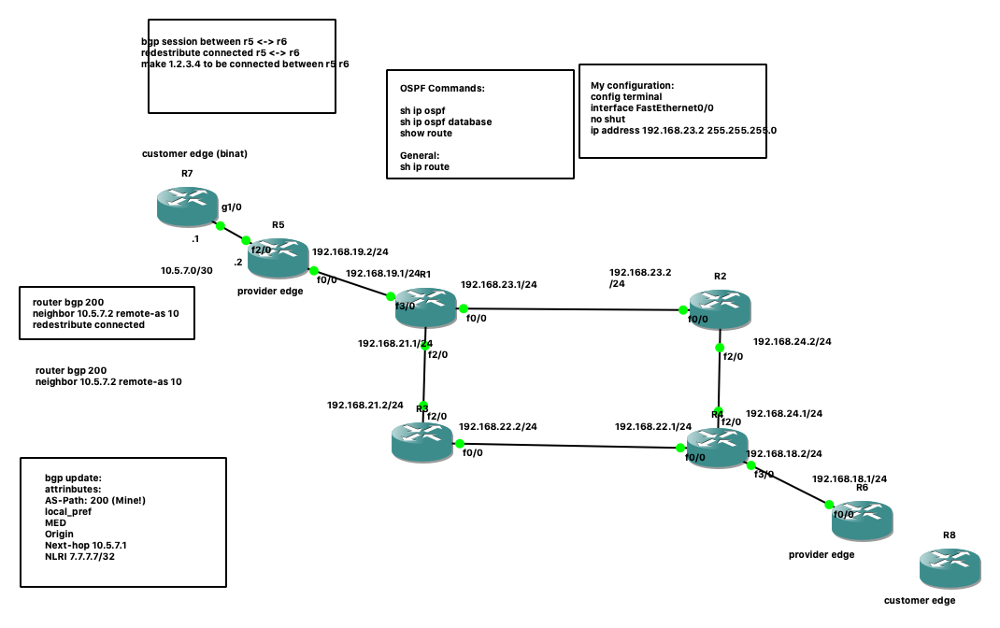

# networking

This is my project of learning basic networking (CCIE) with GNS3 configuration.
The routers I'm working with are:
Cisco IOS Software, 7200 Software (C7200-ADVIPSERVICESK9-M), Version 15.2(4)S5, RELEASE SOFTWARE (fc1)

There's problem sharing in GNS3:
https://www.gns3.com/community/blog/let-s-improve-import-export-shar

